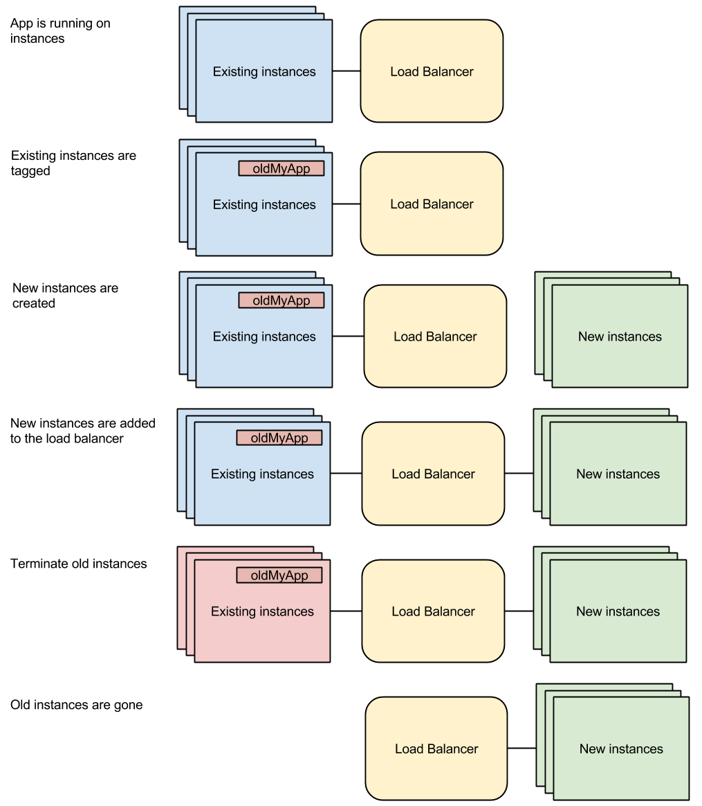
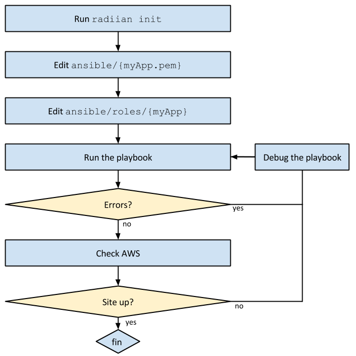
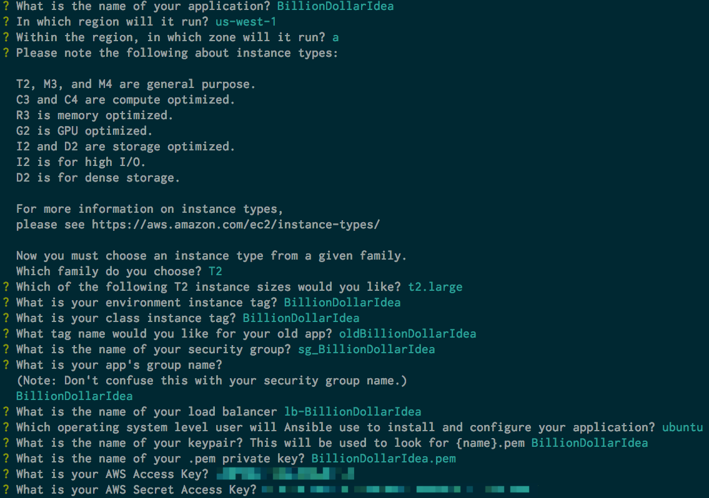
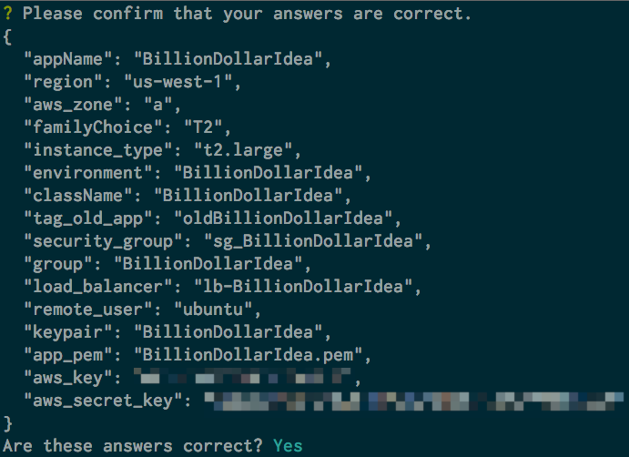

# Radiian

## Radify Immutable Infrastructure for Ansible

### What is Radiian?

Radiian scaffolds an Ansible playbook for deploying immutable infrastructure on AWS. This playbook provides a template for deploying whatever Ansible roles you like in an [immutable fashion](http://radify.io/blog/painless-immutable-infrastructure-with-ansible-and-aws/). It will take care of all the immutable infrastructure side of things (standing up nodes, tearing them down, etc), leaving you free to focus on what you want installed on your nodes.

The generated playbook takes care of the following:

* Tagging old EC2 nodes for termination
* Standing up new EC2 nodes
* Adding the new EC2 nodes to the Elastic Load Balancer (ELB)
* Terminating tagged old EC2 nodes

Your job is then just to configure the Ansible roles that you need to provision your EC2 nodes.

### What is immutable infrastructure?

"Immutable infrastructure, or an immutable deployment, is where infrastructure never changes - it is completely replaced
when a deployment happens. Immutable infrastructure is an attempt to control the amount and location of state in a system.
Instead of the historical pattern of having a group of servers and maintaining them over time, immutable infrastructure
creates new servers on every deploy. You install your application on them, add them to the load balancer, and then remove
and destroy the old nodes. You can achieve rapid results by having a custom base box, which you provision in advance, so
that only your code needs to be deployed" ([_Reducing Infrustration_, radify.io blog](http://radify.io/blog/reducing-infrustration/)).

We also recommend these additional articles to learn more.

* [Painless Immutable Infrastructure with Ansible and AWS](http://radify.io/blog/painless-immutable-infrastructure-with-ansible-and-aws/)
* [Immutable Demo Nodes](http://radify.io/blog/immutable-demo-nodes/)
* [Forward-Only Deployments](http://radify.io/blog/forward-only-deployments/)

### Workflow

### Prerequisites

You should already have set up the following items along with their prerequisites:

* An [AWS Account](https://aws.amazon.com/getting-started/) with the following:
    * Virtual Private Cloud (VPC)
    * Load balancer
    * Security group
    * A domain in route 53
* [Ansible](https://docs.ansible.com/ansible/intro_installation.html)
* [node.js](https://github.com/joyent/node/wiki/installation)

### Install Radiian

`npm install -g radiian`

### Getting Started

`cd` _either_ to an empty directory to create a new project _or_ to an existing directory that contains an AWS project provisioned by Ansible.

Typing `radiian init` will start a question and answer dialogue that will gather all of the necessary data to configure your project automatically. Here you will choose your AWS region, zone, instance type, and much more. _Please note_ that Radiian will write over an existing Ansible directory, so, if you want to keep your old `ansible/` directory, please back it up before running Radiian.  The full dialogue looks like the following:

At the conclusion, you will see a summary of your entries along with an option to confirm whether or not they are correct.

If you see a mistake and have to repeat the dialogue, the default values are conveniently changed to your previous entries, so that you won't be forced to retype correct entries. When finished, Radiian will create an Ansible playbook that is ready for immediate deployment to AWS. The output will read:
`Your playbook has been created in the directory ./ansible`

### Side-note: Security
Guard your AWS credentials very carefully. Sensitive information should _never_ be commited to version control. Once commited, it is very difficult to remove it from your repository's history. At the very least, put `ansible/inventory/aws_keys` and your `.pem` key in your `.gitignore` file. Tools such as [git-crypt](https://github.com/AGWA/git-crypt) and [Ansible Vault](https://docs.ansible.com/ansible/playbooks_vault.html) provide additional security.

### Deployment

`./ansible/provision.sh` deploys your project immediately to AWS. Read `provision.sh` to see exactly what happens. This README is not the place to give a full explanation of [the inner workings of an Ansible playbook](https://docs.ansible.com/ansible/), but here is a quick summary of what happens:

1. If there are any previous nodes, Ansible tags them.
1. Then, Ansible creates a new instance, whose details are mostly contained in `immutable.yaml`.
1. Finally, after everything is up and running smoothly, Ansible destroys the old nodes.

Please see our article [Painless Immutable Infrastructure with Ansible and AWS](http://radify.io/blog/painless-immutable-infrastructure-with-ansible-and-aws/) for a description of how this playbook works.

### Getting Help
`radiian -h` presents a minimal help menu, whereas `radiian -o` opens the much more detailed [online documentation](https://github.com/radify/radiian#readme). Additionally, you may [file an issue](https://github.com/radify/radiian/issues) on Github.

### Semantic Versioning
Radiian, like npm, uses [semantic versioning.](http://semver.org/). Versions tags are found in `git`, `package.json`, and `radiian -V`.
To keep them all synchronized, we do *not* use `git tag` directly. Rather, we run `npm version x.y.z`, which updates the
version number both in `package.json` and in `git`. (In fact, it adds a new `tag` commit automatically.) Because `radiian.js`
receives its version number from `package.json`, there is never a need to update its versioning.

## Contributing

Please see [CONTRIBUTING.md](CONTRIBUTING.md).

## License

Radiian is released under the [MIT License](LICENSE.txt).
